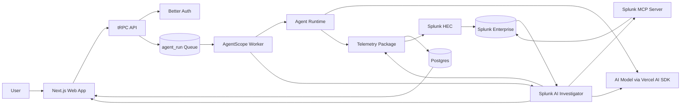

# AgentScope Architecture

This diagram shows how AgentScope interacts with Splunk and where AI models and agents are integrated.

## Data Flow

1. A signed-in user creates or joins an organization backed by `organization_member`.
2. A user queues an AI employee run from the Agents page.
3. The tRPC API writes an `agent_run` row with requester, org, status, attempts, and run input.
4. The AgentScope worker claims eligible runs, locks them, and invokes the Agent Runtime.
5. The runtime calls an AI model through the Vercel AI SDK.
6. Every significant action is emitted as an AgentScope event.
7. The Telemetry package stores the event in Postgres and forwards it to Splunk HEC.
8. The Splunk AI Investigator calls the Splunk MCP Server to search the same session events in Splunk.
9. The worker stores the investigation, output, cost, token counts, and final status on `agent_run`.
10. The UI polls run state and links completed runs to session replay.
11. The Sessions page replays the event trail from Postgres, including the Splunk MCP search event.

## Runtime Splunk Touchpoints

- Splunk HEC receives `agentscope:event` telemetry.
- Splunk MCP Server is called by `packages/agents/src/splunk-investigator.ts`.
- Splunk readiness is exposed through `packages/api/src/router/splunk.ts`.
- The UI exposes the MCP-backed result on `/agents` and `/sessions/[id]`.

## AI Touchpoints

- The Agent Runtime uses the Vercel AI SDK to execute the configured agent model.
- The Splunk AI Investigator uses the Vercel AI SDK to summarize Splunk MCP evidence.
- If Splunk MCP or the configured AI provider is unavailable, AgentScope records the failure as telemetry and returns an explicit API error instead of generating synthetic analysis.
